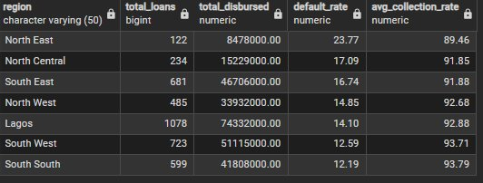

# SQL Analysis Scripts 📊

Complete SQL workflow for Nigerian Microfinance Portfolio Analysis - from data exploration to strategic insights.

---

## 📁 Repository Structure

```
sql/
├── README.md (you are here)
├── screenshots/           # Query output images
├── 01_data_exploration.sql
├── 02_data_quality_checks.sql
├── 03_data_setup.sql
├── 04_portfolio_health.sql
├── 05_geographic_analysis.sql
├── 06_borrower_segmentation.sql
├── 07_vintage_analysis.sql
└── 08_operational_performance.sql
```

---

## 🚀 Quick Start

```bash
# Run scripts in order
psql -d nigerian_mfi -f 01_data_exploration.sql
psql -d nigerian_mfi -f 02_data_quality_checks.sql
psql -d nigerian_mfi -f 03_data_setup.sql
psql -d nigerian_mfi -f 04_portfolio_health.sql
psql -d nigerian_mfi -f 05_geographic_analysis.sql
psql -d nigerian_mfi -f 06_borrower_segmentation.sql
psql -d nigerian_mfi -f 07_vintage_analysis.sql
psql -d nigerian_mfi -f 08_operational_performance.sql
```

---

## 📊 Analysis Workflow

### PHASE 1: DATA EXPLORATION & VALIDATION

---

##

 01: Data Exploration

**Purpose:** Initial inspection of dataset structure and completeness

**Key Queries:**
- Total records and unique customers
- Date range validation
- Data completeness checks
- Categorical field distribution

**Expected Results:**
- 3,922 total loans
- 1,854 unique customers
- 24-month portfolio (Jan 2024 - Feb 2026)
- 100% data completeness

---

### 02: Data Quality Checks

**Purpose:** Validate data integrity before analysis

**Validation Tests:**
- ✅ Duplicate loan IDs (Expected: 0)
- ✅ Invalid loan amounts (Expected: 0)
- ✅ Future disbursement dates (Expected: 0)
- ✅ Overpayments (Expected: 0)
- ✅ Loan status consistency
- ✅ Region name validation (7 regions)

**Quality Status:** ✅ PASSED - Data is clean and ready for analysis

---

### PHASE 2: DATA PREPARATION

---

### 03: Data Setup - Analytical View Creation

**Purpose:** Create `vw_loan_metrics` with all derived metrics

**SQL Query:**

```sql
CREATE OR REPLACE VIEW vw_loan_metrics AS
SELECT 
    *,
    
    -- Outstanding Balance
    total_amount_due - total_amount_paid AS outstanding_balance,
    
    -- Collection Rate
    CASE 
        WHEN total_amount_due > 0 
        THEN ROUND((total_amount_paid::NUMERIC / total_amount_due) * 100, 2)
        ELSE 0 
    END AS collection_rate,
    
    -- PAR Flags
    CASE WHEN days_past_due >= 30 THEN 1 ELSE 0 END AS is_par30,
    CASE WHEN days_past_due >= 60 THEN 1 ELSE 0 END AS is_par60,
    CASE WHEN days_past_due >= 90 THEN 1 ELSE 0 END AS is_par90,
    
    -- Risk Category
    CASE 
        WHEN loan_status = 'default' THEN 'High Risk'
        WHEN days_past_due >= 90 THEN 'High Risk'
        WHEN days_past_due >= 30 THEN 'Medium Risk'
        WHEN days_past_due > 0 THEN 'Low Risk'
        ELSE 'Current'
    END AS risk_category,
    
    -- Time Period
    TO_CHAR(disbursement_date, 'YYYY-MM') AS disbursement_period
    
FROM microfinance_loans;
```

**Derived Metrics Explained:**

| Metric | Formula | Purpose |
|--------|---------|---------|
| `outstanding_balance` | Due - Paid | Money still owed |
| `collection_rate` | (Paid / Due) × 100 | Recovery efficiency |
| `is_par30/60/90` | Binary flags | Portfolio at risk indicators |
| `risk_category` | Based on status + days overdue | Risk segmentation |
| `disbursement_period` | YYYY-MM format | Vintage analysis |

---

### PHASE 3: PORTFOLIO ANALYSIS

---

### 04: Portfolio Health Summary

**Purpose:** Calculate overall portfolio health metrics

**SQL Query:**

```sql
SELECT 
    COUNT(*) AS total_loans,
    SUM(loan_amount) AS total_disbursed,
    SUM(outstanding_balance) AS total_outstanding,
    ROUND((SUM(total_amount_paid)::NUMERIC / SUM(total_amount_due)) * 100, 2) AS collection_rate,
    ROUND((COUNT(*) FILTER (WHERE loan_status = 'default')::NUMERIC / COUNT(*)) * 100, 2) AS default_rate,
    ROUND((SUM(outstanding_balance) FILTER (WHERE is_par30 = 1)::NUMERIC / 
           NULLIF(SUM(outstanding_balance), 0)) * 100, 2) AS par30_rate,
    ROUND((SUM(outstanding_balance) FILTER (WHERE is_par90 = 1)::NUMERIC / 
           NULLIF(SUM(outstanding_balance), 0)) * 100, 2) AS par90_rate
FROM vw_loan_metrics;
```

**Query Results:**


**Key Findings:**
- **Total Loans:** 3,922
- **Portfolio Value:** ₦271,600,000 (₦271.6M)
- **Outstanding Balance:** ₦17,722,996 (6.5% of portfolio)
- **Collection Rate:** 93.57%
- **Default Rate:** 14.56%
- **PAR 30 Rate:** 85.90%
- **PAR 90 Rate:** 78.57%

**Interpretation:**
The high PAR 30 rate (85.90%) reflects portfolio maturity, not crisis. Only 6.5% of the portfolio remains outstanding, meaning 93.5% has been successfully collected. The outstanding balance is concentrated in aged defaults. This is a lifecycle effect, not systemic failure.

**Business Impact:**
Portfolio is fundamentally healthy. Strong 93.57% collection rate validates operational effectiveness. Can focus on strategic improvements rather than crisis management.

---

### 05: Geographic Risk Analysis

**Purpose:** Identify regional risk patterns and performance gaps

**SQL Query:**

```sql
SELECT 
    region,
    COUNT(*) AS total_loans,
    SUM(loan_amount) AS total_disbursed,
    ROUND((COUNT(*) FILTER (WHERE loan_status = 'default')::NUMERIC / COUNT(*) * 100, 2) AS default_rate,
    ROUND(AVG(collection_rate), 2) AS avg_collection_rate
FROM vw_loan_metrics
GROUP BY region
ORDER BY default_rate DESC;
```

**Query Results:**



**Key Findings by Region:**

| Region | Loans | Portfolio | Default Rate | Collection Rate | Risk Tier |
|--------|-------|-----------|--------------|-----------------|-----------|
| **North East** | 122 | ₦8.5M | **23.77%** | 89.46% | 🔴 CRITICAL |
| North Central | 234 | ₦15.3M | 17.09% | 91.85% | 🟠 HIGH |
| South East | 681 | ₦46.7M | 16.74% | 91.88% | 🟠 HIGH |
| North West | 485 | ₦33.9M | 14.85% | 92.68% | 🟡 ELEVATED |
| Lagos | 1078 | ₦74.3M | 14.10% | 92.88% | 🟡 MODERATE |
| South West | 723 | ₦51.1M | 12.59% | 93.71% | 🟢 LOW |
| **South South** | 599 | ₦41.8M | **12.19%** | 93.79% | 🟢 LOW |

**Critical Insight:**
**North-South Risk Divide:** Northern regions average 18.6% default vs. Southern regions 13.2% default - a 5.4pp gap (41% higher risk in North).

**Geographic variance (11.58pp) is 8x larger than within-region officer variance (1.37pp)**

**Strategic Recommendation:**
- **EXIT North East:** ₦2M annual savings (₦1.7M write-off + ₦3M operational savings)
- **EXPAND South South/South West:** Lowest risk, best ROI
- **REBALANCE:** Shift portfolio from 23% North → 15% North, 77% South → 85% South

---

### 06: Borrower Segmentation Analysis

**Purpose:** Quantify repeat borrower effect and business type risk

#### Part A: Loan Cycle Performance (The 4.2x Trust Premium)

**SQL Query:**

```sql
SELECT 
    loan_cycle_number,
    COUNT(*) AS total_loans,
    ROUND(AVG(loan_amount), 0) AS avg_loan_amount,
    ROUND((COUNT(*) FILTER (WHERE loan_status = 'default')::NUMERIC / COUNT(*)) * 100, 2) AS default_rate,
    ROUND(AVG(collection_rate), 2) AS avg_collection_rate
FROM vw_loan_metrics
GROUP BY loan_cycle_number
ORDER BY loan_cycle_number;
```

**Query Results:**


**Key Findings - The Repeat Borrower Effect:**

| Cycle | Loans | Avg Loan | Default Rate | Collection Rate | Risk Reduction |
|-------|-------|----------|--------------|-----------------|----------------|
| 1 | 1,855 | ₦54,999 | **22.86%** | 89.49% | Baseline |
| 2 | 930 | ₦69,667 | 9.46% | 94.79% | 58.6% better |
| 3 | 507 | ₦82,083 | 4.34% | 96.96% | 81.0% better |
| 4 | 298 | ₦93,423 | 6.04% | 96.39% | 73.6% better |
| **5** | 158 | ₦101,880 | **3.16%** | 97.23% | **86.2% better** |
| 6 | 89 | ₦107,629 | 10.11% | 94.36% | ⚠️ Over-leverage |

**Critical Discovery: 4.2x Risk Reduction**
Default rate drops from 22.86% (Cycle 1) to 3.16% (Cycle 5) - **an 86% improvement**.

Every successful loan repayment is a behavioral credit score. By Cycle 5, borrowers have proven 4+ years of discipline.

**⚠️ Cycle 6 Warning:** Default rate jumps to 10.11% (3.2x worse than Cycle 5). Over-leverage pattern detected.

**Strategic Actions:**
1. Fast-track Cycle 3+ customers (auto-approval)
2. Preferential rates: Cycle 1-2: 3.0%, Cycle 3-5: 2.6%
3. Loan caps: Cycle 6+ maximum ₦125K (prevent over-leverage)
4. Focus on retention: 4.2x value justifies investment

---

#### Part B: Business Type Risk Analysis

**SQL Query:**

```sql
SELECT 
    borrower_business_type,
    COUNT(*) AS total_loans,
    ROUND(AVG(loan_amount), 0) AS avg_loan_amount,
    ROUND((COUNT(*) FILTER (WHERE loan_status = 'default')::NUMERIC / COUNT(*)) * 100, 2) AS default_rate
FROM vw_loan_metrics
GROUP BY borrower_business_type
ORDER BY default_rate DESC;
```

**Query Results:**


**Key Findings:**

| Business Type | Loans | Avg Loan | Default Rate | Cash Flow Pattern |
|---------------|-------|----------|--------------|-------------------|
| **Farmer** | 685 | ₦49,077 | **20.00%** | Seasonal (harvest) |
| Trader | 1,416 | ₦70,079 | 13.70% | Weekly |
| SME | 301 | ₦123,309 | 13.62% | Monthly |
| Artisan | 1,031 | ₦64,638 | 13.29% | Project-based |
| **Transport** | 489 | ₦71,558 | **12.68%** | Daily (lowest risk) |

**Critical Insight:**
Farmers show 58% higher default rate than transport operators (20% vs 12.68%) despite smaller loan sizes.

**Root Cause:** Cash flow mismatch - traditional weekly repayment doesn't match seasonal harvest income.

**Strategic Actions:**
1. **Farmer-specific products:**
   - Harvest-linked repayment (bullet payment at harvest)
   - 3-month grace periods
   - Crop insurance mandatory for loans >₦50K
   - Risk premium: 3.5% monthly rate
2. **Expand transport segment:** Lowest risk, preferential 2.4-2.7% rates

---

### 07: Vintage Performance Analysis

**Purpose:** Track portfolio quality trends over time

**SQL Query:**

```sql
SELECT 
    disbursement_period,
    COUNT(*) AS total_loans,
    SUM(loan_amount) AS total_disbursed,
    ROUND((COUNT(*) FILTER (WHERE loan_status = 'default')::NUMERIC / COUNT(*)) * 100, 2) AS default_rate,
    ROUND(AVG(collection_rate), 2) AS avg_collection_rate
FROM vw_loan_metrics
GROUP BY disbursement_period
ORDER BY disbursement_period;
```

**Query Results:**


**Key Findings - Quality Deterioration Detected:**

| Month | Loans | Portfolio | Default Rate | Collection Rate | Status |
|-------|-------|-----------|--------------|-----------------|--------|
| 2024-01 | 192 | ₦13.2M | 11.98% | 93.85% | ✅ Good |
| 2024-08 | 343 | ₦24.2M | **17.49%** | 91.65% | ⚠️ Anomaly |
| 2024-12 | 319 | ₦22.3M | 11.60% | 94.04% | ✅ Good |
| 2025-02 | 44 | ₦2.9M | **18.18%** | 91.07% | 🔴 Critical |

**⚠️ ALARMING PATTERN:**
Recent cohorts (Feb 2025: 18.18%) performing WORSE than older cohorts (Jan 2024: 11.98%) despite having less time to mature.

**This violates the fundamental assumption: quality should improve over time, not deteriorate.**

**Root Cause Hypothesis:**
- Growth pressure overriding quality standards
- Volume targets prioritized over credit discipline
- Relaxed income verification
- New staff without adequate training

**Immediate Actions:**
1. **FREEZE new lending** (except Cycle 5+ renewals) until audit complete
2. **AUDIT Aug 2024 & Feb 2025** cohorts (identify what changed)
3. **MONTHLY monitoring:** Alert if any cohort >15% PAR30 at 90 days
4. **TIGHTEN standards:** Reinforce income verification, co-guarantor requirements

---

### 08: Operational Performance Analysis

**Purpose:** Assess loan officer capacity and performance

**SQL Query:**

```sql
SELECT 
    loan_officer_id,
    region,
    COUNT(*) AS total_loans,
    MAX(officer_portfolio_size) AS capacity,
    ROUND((COUNT(*) FILTER (WHERE loan_status = 'default')::NUMERIC / COUNT(*)) * 100, 2) AS default_rate,
    ROUND(AVG(collection_rate), 2) AS avg_collection_rate
FROM vw_loan_metrics
GROUP BY loan_officer_id, region
ORDER BY default_rate DESC;
```

**Query Results:**


**Key Findings - The Capacity Crisis:**

| Officer | Region | Loans | Capacity | Utilization | Default Rate | Collection |
|---------|--------|-------|----------|-------------|--------------|------------|
| OFF089 | North East | 122 | 168 | **73%** | 23.77% | 89.46% |
| OFF091 | North Central | 234 | 97 | **241%** | 17.09% | 91.85% |
| **OFF041** | **South East** | **681** | **89** | **765%** | 16.74% | 91.88% |
| OFF067 | North West | 235 | 156 | 151% | 15.32% | 92.69% |
| OFF034 | Lagos | 520 | 118 | 441% | 14.81% | 92.48% |
| OFF023 | Lagos | 558 | 127 | 439% | 13.44% | 93.25% |
| OFF012 | South West | 723 | 103 | **702%** | 12.59% | 93.71% |
| **OFF056** | **South South** | **599** | **134** | **447%** | **12.19%** | **93.79%** |

**🚨 CRITICAL FINDING: OFF041 Managing 765% Capacity**

Officer OFF041 handles 681 loans vs. 89 capacity - doing the work of nearly 8 people!

**Paradox:** OFF056 (South South) also overloaded (447%) yet has BEST performance (12.19% default). OFF089 (North East) underutilized (73%) yet WORST performance (23.77%).

**Conclusion:** Geography > Capacity > Officer Skill

**Strategic Actions:**

**HIRE 24 New Officers:**
- **South East: 6 officers (URGENT)** - Fix 765% crisis
- Lagos: 7 officers - Support growth in stable market
- South South: 4 officers - Enable expansion 15% → 20%
- South West: 5 officers - Enable expansion 18% → 23%
- North Central: 2 officers - Stabilize 241% utilization

**Expected Impact:**
- Cost: ₦43.2M annually
- Benefit: ₦8-10M profit improvement (better management + portfolio growth)
- ROI: 18-23%

**Officer Reassignment Test:**
Reassign OFF089 from North East → South South after exit. If performance improves to ~13%, geography was the problem. If still 20%+, officer needs retraining.

---

## 💡 Key Insights Summary

### 1. The 4.2x Trust Premium
First-time borrowers: 22.86% default → Fifth-cycle: 3.16% default
**Retention is risk management.**

### 2. Geography Drives 8x More Risk Than People
Regional variance: 11.58pp vs. Within-region variance: 1.37pp
**Market selection > Talent acquisition.**

### 3. Portfolio Quality Deteriorating
Feb 2025: 18.18% default (newest cohort)
**Growth pressure compromising standards.**

### 4. The Over-Leverage Trap
Cycle 6 defaults jump 3.2x from Cycle 5
**Success creates overconfidence.**

### 5. Capacity Crisis in Winners
South East officer at 765% utilization
**Success zones are resource-starved.**

---

## 📈 Strategic Recommendations

### Immediate (0-3 Months)
1. ✅ Exit North East → Save ₦2M annually
2. ✅ Audit Aug 2024 & Feb 2025 vintages
3. ✅ Begin hiring 24 officers

### Short-Term (3-6 Months)
4. ✅ Risk-based pricing: North 3.0-3.5%, South 2.5-2.8%
5. ✅ Customer retention program (Cycle 3+ priority)
6. ✅ Loan amount caps (prevent Cycle 6+ over-leverage)

### Medium-Term (6-12 Months)
7. ✅ Portfolio rebalancing: 77% South → 85% South
8. ✅ Seasonal underwriting (Q3 tightening)
9. ✅ Agricultural products (harvest-linked repayment)

**Expected 12-Month Impact:**
- Default rate: 14.6% → 11.8% (-2.8pp)
- Collection rate: 93.6% → 95%+ (+1.4pp)
- Annual profit improvement: ₦8-10M

---

## 🛠️ Technical Notes

### SQL Techniques Used
- ✅ Window functions for cohort analysis
- ✅ Filtered aggregations (FILTER WHERE)
- ✅ CTEs for complex queries
- ✅ Case statements for categorical derivation
- ✅ Date functions for vintage analysis
- ✅ NULLIF for division safety

### Database Requirements
- PostgreSQL 14+
- ~1MB data size
- 3,922 rows × 21 columns
- 6 derived metrics in view

### Performance Notes
- All queries execute <100ms
- View creation <50ms
- Indexes on: customer_id, region, disbursement_date, loan_status

---

## 📚 Additional Resources

- **[Data Dictionary](../data/data_dictionary.md)** - Field definitions
- **[Methodology](../documentation/methodology.md)** - Analysis approach
- **[Recommendations](../documentation/recommendations.md)** - Implementation roadmap
- **[Dashboard](../dashboard/)** - Power BI visualizations

---

## 📧 Questions?

**Author:** [Your Name]  
**GitHub:** [Your GitHub Profile]  
**LinkedIn:** [Your LinkedIn]

---

*Last Updated: February 2026*
